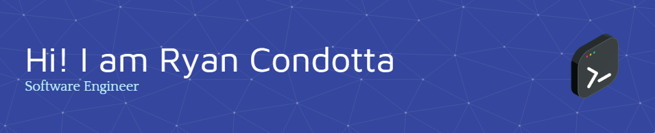

I am a software engineer with experience in a multitude of programming languages. I have a strong passion for problem-solving and finding the best solutions. I am always open to learning and expanding my knowledge to stay up-to-date with the latest technologies and industry trends.

* 🌍  I'm based in Virginia
* 🖥️  See my portfolio at [rccondotta](https://rccondotta.netlify.app/)
* ✉️  You can contact me at [rccondotta@gmail.com](mailto:rccondotta@gmail.com)
* 🧠  I'm learning I'm learning Web Development (HTML, CSS, Javascript, React, Node.js, Next.js)
* 🤝  I'm open to collaborating on any new projects! I love to design and implement!

### Skills

### Socials

 <a href="https://codesandbox.io/u/rccondotta" target="_blank" rel="noreferrer"> <picture> <source media="(prefers-color-scheme: dark)" srcset="https://raw.githubusercontent.com/danielcranney/readme-generator/main/public/icons/socials/codesandbox-dark.svg" /> <source media="(prefers-color-scheme: light)" srcset="https://raw.githubusercontent.com/danielcranney/readme-generator/main/public/icons/socials/codesandbox.svg" />  </picture> </a> <a href="https://www.github.com/rccondotta" target="_blank" rel="noreferrer"> <picture> <source media="(prefers-color-scheme: dark)" srcset="https://raw.githubusercontent.com/danielcranney/readme-generator/main/public/icons/socials/github-dark.svg" /> <source media="(prefers-color-scheme: light)" srcset="https://raw.githubusercontent.com/danielcranney/readme-generator/main/public/icons/socials/github.svg" />  </picture> </a> <a href="https://www.linkedin.com/in/ryan-condotta" target="_blank" rel="noreferrer"> <picture> <source media="(prefers-color-scheme: dark)" srcset="undefined" /> <source media="(prefers-color-scheme: light)" srcset="https://raw.githubusercontent.com/danielcranney/readme-generator/main/public/icons/socials/linkedin.svg" />  </picture> </a>

### Projects

#### Machine Learning / AI Repositories

* [TensorFlow](https://github.com/rccondotta/TensorFlow)
* [PyTorch](https://github.com/rccondotta/PyTorch)
* [LLM Q&A](https://github.com/rccondotta/LLM-Q-A)
* [OpenCV](https://github.com/rccondotta/OpenCV)

#### Web Development Repositories

* [Netflix Clone](https://github.com/rccondotta/netflix-clone)
* [Crown Clothing](https://github.com/rccondotta/Crown-Clothing)
* [Discover Coffee](https://github.com/rccondotta/Discover-Coffee)
* [Smart Brain](https://github.com/rccondotta/smart-brain)
* [NASA MERN](https://github.com/rccondotta/NASA-MERN)
* [Javascript Projects](https://github.com/rccondotta/Javascript-Projects)
* [AI-SaaS](https://github.com/rccondotta/ai-saas)

