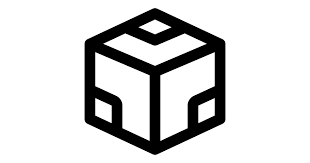

Hi My name is Ryan Condotta
=====================================================================================================================================

Software Engineer
-----------------

* ✉️  You can contact me at [rccondotta@hotmail.com](mailto:rccondotta@hotmail.com)
* 🧠  I'm learning Web Development (HTML, CSS, Javascript, React, Node.js, Next.js)
* 🤝  I'm open to collaborating on any ML / DL / CV or Web Development Projects

### Skills

 

### Socials

  

### Other Platforms

    <h2>Other Platforms</h2>
    <table align="left">
        <tr>
            <td align="center" width="140" height="112.43">
                <!-- Replace '#' with the link to your Hugging Face profile -->
                <a href="#">
                    
                      Hugging Face
                </a>
            </td>
            <td align="center" width="140" height="112.43">
                <!-- Replace '#' with the link to your Code Sandbox profile -->
                <a href="#">
                    
                      Code Sandbox
                </a>
            </td>
        </tr>
    </table>

